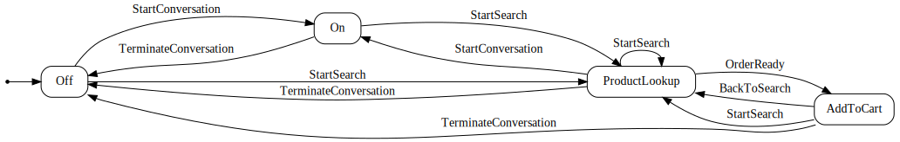

# Main Components

# Dispatcher Class Documentation

The `Dispatcher` class is responsible for managing the interaction between the user and the vending machine state machine. It initializes services, loads products, listens to customer inquiries, and handles the conversation workflow.
This is a 'Boss' class which is facing customer. This class is an entry point for our app.

## Methods

### StartConversation()

This is main entry Starts the conversation with the customer.

- **Steps:**
  - Engages the vending machine workflow.
  - Displays the greeting message to the customer.
  - Listens to customer inquiries and processes them.
  - Handles different conversation intents and triggers appropriate actions.
  - Terminates the conversation when the customer is done.

### Init()

Initializes the `Dispatcher` by setting up the necessary services and configurations by using Microsoft Dependency injection framework.

- **Services Initialized:**
  - `IAIService`: Handles AI-related tasks such as generating embeddings and extracting intents.
  - `IProductService`: Manages product-related operations such as adding and retrieving products.

- **Configuration:**
  - Retrieves Azure OpenAI API key, endpoint, and embedding endpoint from the configuration manager.
  - Initializes the AI service with the retrieved configurations.

### LoadProducts()

Loads products from a JSON file and adds them to the product service.

### ListenToCustomer()

Gets customer input from the console.

### GetCustomerMessageAndPassIt2AI()

Gets customer input and passes it to the AI service to extract intent.

### DisplaySearchResults(List<ProductSearchResult> searchResult)

Displays the search results to the customer.

### DisplayReceipt(List<OrderItem> items)

Displays the receipt to the customer after an order is ready.
  - Writes the total amount charged to the console.

### SetupSearch(VendingMachine workflow, ConversationIntent intent)

Prepares our vending machine for product search.

# VendingMachine Class Documentation

The `VendingMachine` class manages the state and workflow of the vending machine system. It handles product search, order management, and conversation state transitions using the Stateless library.

## Methods

### Engage()

Engages the vending machine workflow by initializing the prompt helper and starting the conversation.

- **Steps:**
  - Initializes the `PromptHelper` with department names.
  - Sets the greeting message for the customer.
  - Fires the `StartConversation` trigger to transition to the `On` state.

### SearchProduct()

Initiates a product search based on the query embedding and department.

- **Steps:**
  - Asserts that the query embedding and department are not null.
  - Fires the `StartSearch` trigger to transition to the `ProductLookup` state.
  - Retrieves similar products using the product service.
  - If no products are found, sets a message for the customer and transitions back to the `On` state.

### Finish()

Terminates the conversation and sets a thank you message for the customer.

- **Steps:**
  - Fires the `TerminateConversation` trigger to transition to the `Off` state.
  - Sets the message for the customer to thank them for using the service.

### AddOrderItems(List<OrderItem> items)

Adds order items to the vending machine and calculates the total order amount.

- **Steps:**
  - Adds the order items to the `OrderItems` list.
  - Fires the `OrderReady` trigger to transition to the `AddToCart` state.
  - Calculates the total order amount.

### TryAddOrderItems(string inquiry)

Attempts to parse and add order items from the customer's inquiry.

- **Steps:**
  - Asserts that the product search results are not empty.
  - Parses the inquiry to extract order items.
  - If order items are successfully parsed, adds them to the vending machine and returns `true`.
  - If parsing fails, returns `false`.

### GetInfo()

This is utility method that helps to plot the graph of our state machine.

- **Steps:**
  - Returns the state machine information using the `GetInfo` method from the Stateless library.

